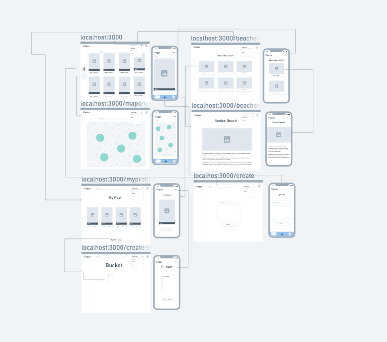

 
## Viaggio ✈️

Viaggio is a travel inspiration app designed to fuel your travel exploration dreams and make them a reality. Recognizing there were no apps dedicated specifically to the dream stage of travel, we set out to solve this problem. 

##### *"You have to dream before your dreams can come true"* ~ A.P.J. Abdul Kalam
---
## Check out the app

Click here to explore the [Viaggio](https://viaggio-front-end.herokuapp.com/) web application. 

On Viaggio, users can:

* Create a bucket list of travel ideas 
* Share travel stories and photos
  
From the profile view, a user can view all posts they've personally shared.

---
## Views

---
## Technologies Used

---
## Acknowledgements
Viaggio was developed collaboratively by myself Georgios Katsikis, [Kevante Grimes](https://github.com/kevanteaniah), and [Zuri Lyons](https://github.com/Zee22780) . 

---
## Ice Box 

- [ ] Allow users to view the profile pages of other users 
- [ ] Allow users to "like" a post or comment
- [ ] Add API data which will allow users to identify places they want to visit from within the site and add it to their bucket list
- [ ] Allow users to update or edit bucket list

 
